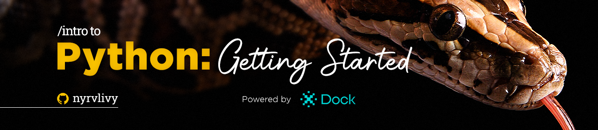

  

 

  <h1 align="center">Python Education Repository</h1>
  
Welcome to the Python Education Repository! 

  
  
  

##

## Table of Contents

- [Introduction](#introduction)
- [Project Structure](#project-structure)
- [How to Navigate](#how-to-navigate)
- [Contributing](#contributing)
- [License](#license)

## Introduction

This repository has been purposefully created to serve as my **personal record of activities** as I embark on my journey as a Python novice.

However, it is also intended to be a valuable educational resource for you, as I plan to document my progress and understanding of the language here.

This documentation will encompass a variety of _exercises_, _explanations_, _notes_, and _small projects_, spanning from the **beginner level** to the **intermediate level**.

If you feel comfortable, please **fork** the repository and _make_ any _necessary additions_ or _modifications_.

You can contact me via a _pull request (PR)_ or by _sending an email_ to [brumassiip@gmail.com](mailto:brumassiip@gmail.com).

## Project Structure

The repository is organized into three main skill levels:

1. **Beginner**: Designed for those who are new to Python, this section provides basic explanations, easy-to-follow activities, and simple exercises to help you get started.

2. **Basic**: For those with some Python experience, this section offers a deeper dive into Python concepts, along with exercises and classwork assignments to reinforce your learning.

3. **Intermediate**: Aimed at more experienced Python developers, this section includes more advanced topics, homework assignments, and small projects to challenge your skills.

Inside each level, you will find two folders:

- **🏫 | Classwork**: This folder contains class assignments and explanations for in-class activities.

- **🏠 | Homework**: Here, you'll find assignments to complete on your own, often with more complexity to further your understanding.

## How to Navigate

To navigate through the repository and access the learning materials, follow these steps:

1. **Choose Skill Level:** Pick your Python proficiency level: *beginner*, *basic*, or *intermediate*.

2. **Select Activity Type:** Decide between *classwork* or *homework* assignments.

3. **Explore Activities:** In the respective folders, find individual activities with *README files* for guidance.

4. **Start Coding:** Follow the `README.md` instructions to complete tasks and learn as you go.

## Contributing

**Contributing is a powerful way to share our knowledge and experience for the creation of a more inclusive and welcoming community.** 

If you have educational materials, exercises, or Python-related projects that you'd like to share with us, please feel free to do so. *Consider making a contribution*:

- [x] **Fork this repository** to your GitHub account;
- [ ] **Clone your repository** to your local machine;
- [ ] **Create your content** by adding materials, explanations, activities, or projects to the relevant category and level;
- [ ] **Submit a Pull Request** to this repository for review and potential merging;
- [ ] **Give Credit** 🎉;

<!-- Please review the [CONTRIBUTING.md](CONTRIBUTING.md) file for more detailed information on contributing guidelines. -->

## License

This **Python Education Repository** is licensed under the [MIT License](LICENSE). You are free to use, modify, and distribute the materials within this repository for educational purposes. 

*However*, please be aware that third-party libraries or resources may come with their own licenses and usage restrictions, and it is crucial to bear in mind the importance of providing proper attribution when required to comply with licensing requirements.

##

### ⚠️ ATTENTION ⚠️

**Important Note:** _Kindly be aware that this serves as my personal record for extracurricular school activities. It comprises numerous date and time entries, facilitating a thorough analysis of my growth and proficiency throughout my learning journey and exercise execution._

**If your intention is to embark on a Python learning journey from the very beginning, I recommend seeking more pedagogically structured explanations elsewhere.**

##

**Start your Python learning journey right now! Happy coding! 🐍💻**

##

###### tags: `Backend` `Python` `Beginner` `Basic` `Intermediate` `Educational` `Programming-Logic`

  

